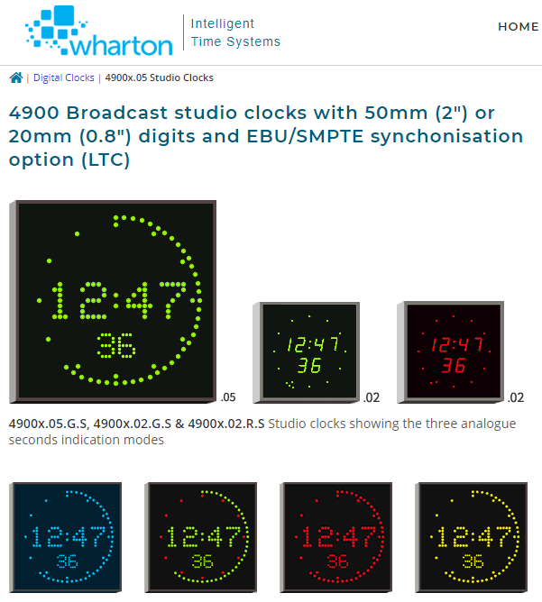
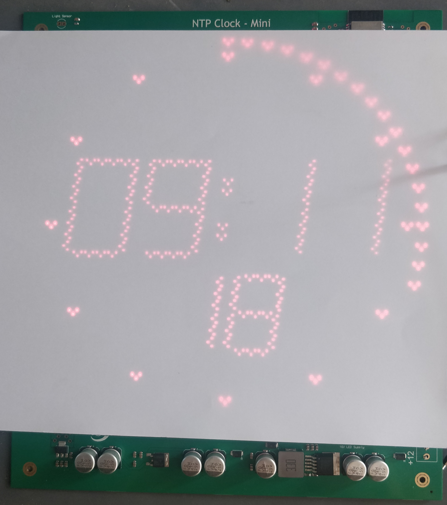
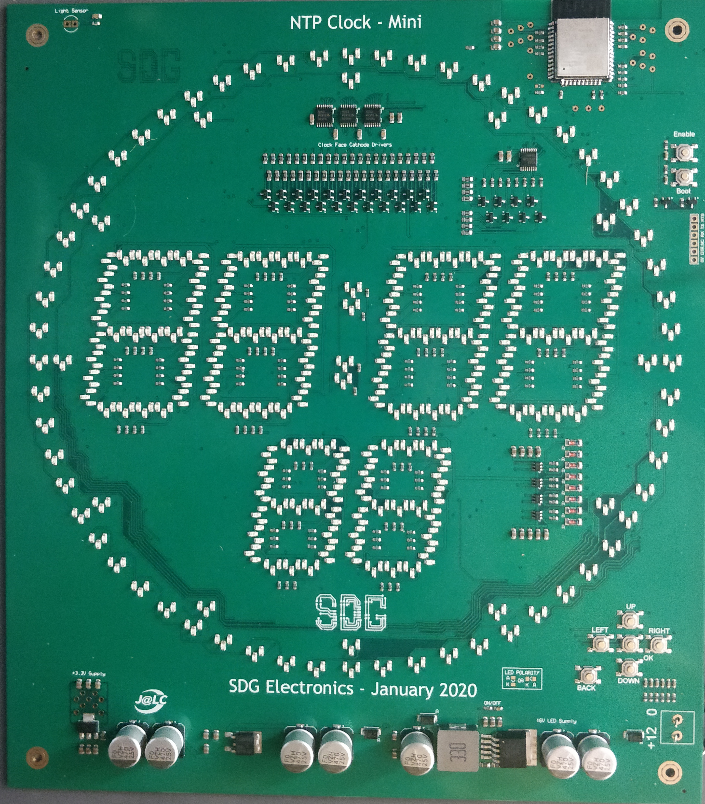

# SDK Electronics Mini Clock

[Wharton Studio Clocks](https://www.wharton.co.uk/digital-clocks/4900050-radio-tv-studio-digital-clocks.htm) are pretty iconic. You can meet their iconic design in many TV and Radio studios around the world (I first met them, when being at CERN). They are a bit pricey.

Fortunately, Steven from SDG Electronics have designed [mini clock](https://sdgelectronics.co.uk/wharton/) inspired by Wharton's look. Check the project page for an excellent videos describing the whole design as well as walk-through how to upload production files to JLCPCB for manufacturing.

Purpose of this repository is to provide mirror for the production files as well as to have a place to keep history of changes into the firmware. And maybe also to collaborate. PR are welcome.

Project structure:
- [`fw`](fw/): Code for ESP32-WROOM-32D using Espressif IDF.
- [`hw`](hw/): Hardware design files.
- [`hw_prodfiles`](hw_prodfiles/): Hardware production files. Tested with JLCPCB. Layer stack is `GTL--G2L--G3L--GBL`.

